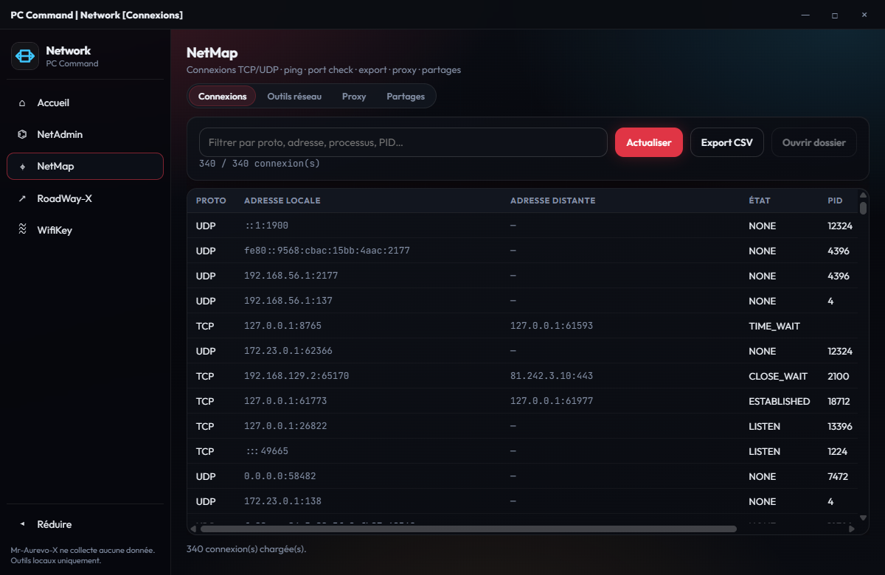

[Français](README.md) · [English](README.en.md)

# Hub-Reseau — PC Command

Distribution **lecture seule**. Pas de pull requests ni d’issues (`CONTRIBUTING.md`).

Hub **Réseau** — Dashboard + modules natifs. Licence PolyForm Noncommercial 1.0.0. Éditeur : **Mr-Aurevo-X**.

**Local-first.** Exceptions réseau honnêtes : tests vers les hôtes que vous saisissez ; réputation RoadWay-X en opt-in (URLhaus / AbuseIPDB). Voir `PRIVACY.md`.

## Aperçu

| Accueil | Module |
|---------|--------|
|  |  |

## Modules

| Module | Rôle |
|--------|------|
| NetAdmin | Adaptateurs, hosts, firewall |
| NetMap | Connexions · ping · proxy · partages |
| RoadWay-X | Trafic live · alertes · réputation opt-in |
| WifiKey | Profils Wi-Fi (ConfirmGate) |

## Lancer

```bat
Lancer.cmd
```

Windows peut afficher « potentiellement dangereux » : les binaires ne sont pas signés Authenticode (pas de certificat éditeur payant). C’est un avertissement de réputation SmartScreen, pas un verdict antivirus.

Titres HWND : `PC Command | Network` / `[Module]`. Isolation : `ISOLATION.md`.

---

Rêvée par **Mr-Aurevo-X**. Cursor a réalisé le rêve.

[](https://discord.com/users/406891052516114442)
[](https://www.paypal.com/paypalme/aurevo1)
[](https://revolut.me/mr_aurevo_x)
