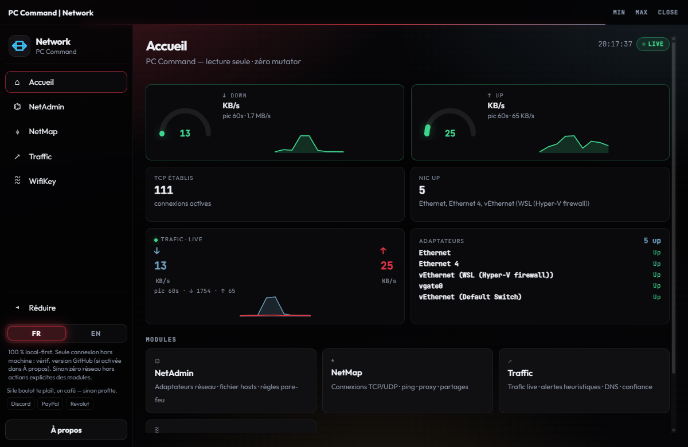
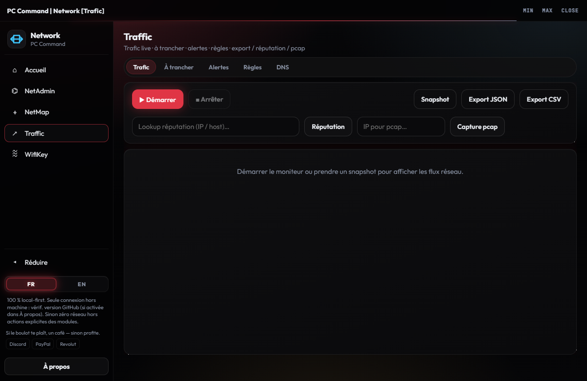

[Français](README.md) · [English](README.en.md)

# PC Command | Network

Hub **Réseau** — adaptateurs, carte, trafic live, Wi‑Fi. Accueil débit / connexions.  
**Gratuit à vie** · **autant local que possible** · **Mr-Aurevo-X**

## Aperçu

| Accueil | Traffic |
|---------|---------|
|  |  |

## Modules

| Module | Rôle |
|--------|------|
| NetAdmin | Adaptateurs, hosts, firewall, DNS |
| NetMap | Connexions · ping · proxy · partages · test de site |
| **Traffic** | Trafic live · alertes · réputation (si tu l’actives) |
| WifiKey | Profils Wi‑Fi — confirmation avant action |

## Pourquoi ce hub

- Gratuit à vie — pas d’abonnement, pas de compte
- Autant local que possible — **pas d’appel serveur caché**
- **Module pas utilisé = pas de sortie réseau liée**
- Réseau seulement si tu agis : cibles / URL que **tu** saisis · réputation Traffic **seulement si activée** · vérif. maj GitHub **désactivable** dans À propos
- Confirmation avant les actions qui changent le réseau (DNS, coupure, Wi‑Fi…)
- Interface FR | EN
- Accueil en lecture seule

## Sur ton PC

| Quoi | Où |
|------|-----|
| **App** | Extrais `Launch-Hub-Reseau.zip`, lance `Launch-Hub-Reseau.exe` |
| Métadonnées | `%LOCALAPPDATA%\PCCommand\` |
| Préférences | `%LOCALAPPDATA%\Mr-Aurevo-X\user-settings.json` (partagé) |
| Données Traffic | `%LOCALAPPDATA%\Mr-Aurevo-X\RoadWay-X\` |

[Télécharger la release](https://github.com/Mr-Aurevo-X/Hub-Reseau/releases) · **v2.0.0**

## Lancer

1. Télécharge le zip sur la page Releases ci-dessus  
2. Extrais où tu veux  
3. Lance `Launch-Hub-Reseau.exe` (Windows demandera l’admin)

Windows peut afficher un avertissement : les binaires ne sont **pas signés**. C’est **SmartScreen**, pas un antivirus qui dit « virus ».

## Version officielle uniquement

La seule version que je cautionne :

**https://github.com/Mr-Aurevo-X/Hub-Reseau**

Un fork ou une copie modifiée ailleurs **n’est pas** ma version — je n’en suis pas responsable.  
Logiciel **tel quel**, sans garantie — détails dans `LICENSE` et `PRIVACY.md`.

## Soutien (optionnel)

Si le boulot te plaît, un café — sinon profite.

---

Rêvée par **Mr-Aurevo-X**. Cursor a réalisé le rêve.
